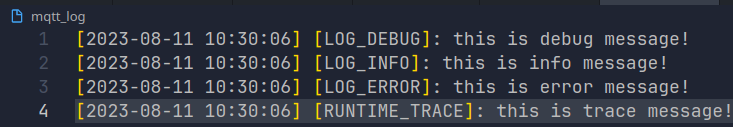

# C-LOGGER

> Simple code for printing colored logs to the terminal or saving them to a file using C.

## Usage

- 4 log level for stdout:

```c

DEBUG("This is debug info with color: %s", "blue");
INFO("This is info info with color: %s", "green");
ERROR("This is error info with color: %s", "red");
TRACE("This is error info with color: %s", "orange");
```

- Output:


- In the log file storage, there are 3 log levels with limits. If the log surpasses the defined limit, the program will automatically delete the first 300 lines from the log to allow continuous writing (specified by `NUMBER2DEL` in the file header).

```c
// Initialize the log with a log name and set a log size limit.
log_profile_t* log_profile = init_logger_file("mqtt_log", 1 * MB);
// Begin writing logs.
STORE_DEBUG("this is debug message!",log_profile);
STORE_INFO("this is info message!",log_profile);
STORE_ERROR("this is error message!",log_profile);
STORE_TRACE("this is trace message!",log_profile);
// Close the profile.
close_log_profile(log_profile);

```

- Output:



- You can enable timestamp, file line info, and color output by `-D` option in Makefile:
  - `-DUSE_DEBUG_LINE`
  - `-DUSE_COLOR`
  - `-DUSE_TIMESTAMP`

## Build

- Support static library, define  `INCLUDE_PATH` and `LIBRARY_PATH` then build with command:

```bash
make lib
make install
```