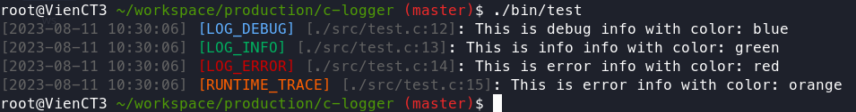

# C-LOGGER

> A simple code for printing colored logs to the terminal or saving to a file, using C.

## Usage

- 3 log level for stdout:

```c

DEBUG("This is debug info with color: %s", "blue");
INFO("This is info info with color: %s", "green");
ERROR("This is error info with color: %s", "red");
```

- Output:


- 3 log level for log file storage with limit, if the log exceeds the defined limit, the program will delete the first 300 lines of the log to continue writing (specified by `NUMBER2DEL` in the file header):

```c
// init log with log_name and log size limit, this profile with save in .cache
log_profile_t* log_profile = init_logger_file("mqtt_log", 1 * MB);
// start write log
STORE_DEBUG("Start write to log!",log_profile);
STORE_INFO("store sample!",log_profile);
STORE_ERROR("i don't feel so good,...",log_profile);

```

- Output:


- You can enable timestamp, file line info, color output by:
  - `-DUSE_DEBUG_LINE`
  - `-DUSE_COLOR`
  - `-DUSE_TIMESTAMP`
